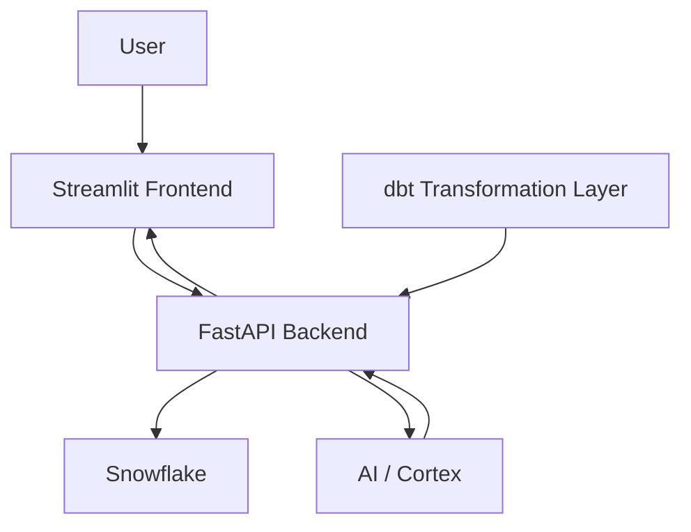

# ReviewSense AI

## Project Overview

ReviewSense-AI is an AI-powered Customer Review Insights Copilot built on Snowflake, dbt, FastAPI, Streamlit, and GenAI tools. It analyzes Amazon product reviews to generate actionable insights such as sentiment trends, major themes, common complaints, and product improvement suggestions.

The goal of the project is to transform large volumes of unstructured customer review data into structured, useful business intelligence that supports faster analysis and better decision-making.

---

## Problem

Customer reviews are highly unstructured and difficult to analyze manually at scale. Important signals such as recurring complaints, sentiment patterns, and product improvement opportunities are often buried in large volumes of raw review text.

---

## Solution

We built an end-to-end review intelligence system that combines data engineering, analytics, and AI to:

- Ingest and clean review data
- Transform raw reviews into structured analytical models
- Support analytics and insight generation
- Generate AI-powered summaries and business insights
- Deliver results through an interactive application interface

---

## System Architecture

ReviewSense-AI connects the frontend, backend, data pipeline, and AI components in one end-to-end workflow. Users interact with the application through the Streamlit frontend, which sends requests to the FastAPI backend. The backend coordinates structured data from Snowflake and dbt with AI-powered analysis components to generate insights and return them to the user interface.

**High-level flow:**  
User → Streamlit Frontend → FastAPI Backend → Snowflake / dbt / AI Components → Streamlit Frontend

## Tech Stack

Frontend: Streamlit
Backend: FastAPI
Data Warehouse: Snowflake
Transformation Layer: dbt
AI Layer: Snowflake Cortex / GenAI components
Programming / Query Language: Python, SQL
Version Control: GitHub

## Current Progress

Completed:

- Data ingestion
- Data transformation
- Data validation
- Analytics preparation

Next steps:

- Embeddings
- RAG pipeline
- Insight generation

## Project Log

See: docs/project_log.md
